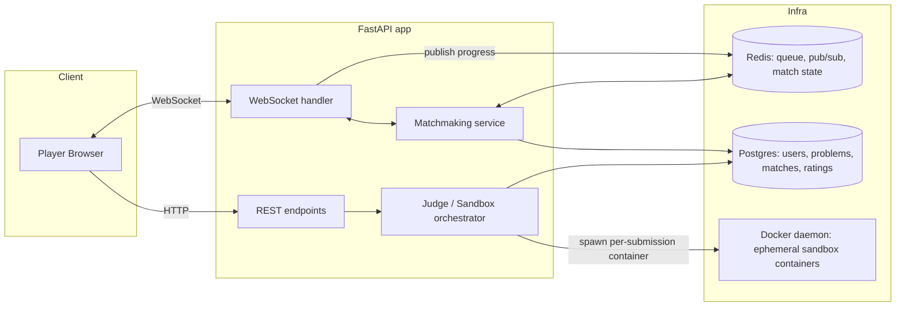

# CodeDuel

A real-time 1v1 competitive coding duel platform — "chess.com for coding".
Two players get the same problem and race to submit a correct solution
first, with live visibility into each other's progress (but never each
other's code).

Built as a backend/distributed-systems portfolio project: sandboxed
untrusted-code execution, real-time sync over WebSockets, and
race-condition-safe match resolution.

## Screenshots

Two independent logged-in browser sessions racing the same problem in real
time — everything below is the actual app, not a mockup.

| | |
|---|---|
|  |  |
| Match complete — winner/loser banners + Elo rating swing | Live duel — opponent's test-pass progress streaming over WebSocket |
|  |  |
| Lobby — matchmaking queue | Just matched — same problem, empty scoreboard |
|  |  |
| Auth | Waiting for an opponent |

## Status

- [x] Problem model + sandboxed submission judging
- [x] Matchmaking (Redis queue)
- [x] WebSocket match rooms + live opponent progress
- [x] Race-condition-safe win determination
- [x] Elo rating
- [x] Auth (email/password)
- [x] React frontend (register → matchmaking → live duel → winner banner)

## Architecture



## Key design decisions

- **Sandboxing (Docker, not nsjail/firejail):** each submission runs in a
  brand-new, non-root, throwaway container, always removed afterward.
  Two-layer timeout: the in-container harness kills a runaway process
  group, and the host additionally force-kills the whole container as a
  backstop. See `execution/`.
- **Judging model:** submissions run as opaque subprocesses — stdin in,
  stdout diffed against expected output — the same model real
  competitive-programming judges use, and one that doesn't require
  importing/trusting the submitted code as a library.
- **Matchmaking:** a plain Redis list + `BLPOP` (atomic pop, no
  application-level locking needed) paired by a single background task.
  A pending-set + startup reconciliation step makes pairing crash-safe —
  a player popped off the queue is never silently lost if the process
  dies mid-pair.
- **Live progress:** WebSocket connections subscribe to a Redis pub/sub
  channel per match rather than a local in-process connection registry,
  so it stays correct if this ever runs on more than one instance.
  Redaction (never leaking code or per-test results to the opponent)
  happens once, at the publisher.
- **Win determination:** a single atomic
  `UPDATE matches SET status='completed', winner_id=X WHERE status='in_progress'`.
  Postgres's row-level serialization guarantees exactly one of two
  simultaneous winning submissions gets `won_match=true` — no explicit
  locking, no lost update.
- **Elo updates:** a genuinely different concurrency shape (need both
  players' current ratings before computing either new one), so this uses
  `SELECT ... FOR UPDATE` on both rating rows instead, locked in a
  consistent order (sorted by `player_id`) to avoid deadlocks between
  concurrent updates touching the same pair of players.
- **Auth:** bcrypt for password hashing; opaque session tokens in Redis
  (not JWT) so logout actually revokes a session immediately. Every
  request resolves `player_id` server-side from the token — the client
  can never supply its own identity.

## Local development

Prereqs: Docker Desktop running, Python 3.14+.

```bash
cd backend

# 1. Infra
docker compose up -d              # Postgres + Redis

# 2. Sandbox image (what actually executes submitted code)
docker build -t codeduel-python-runner:latest app/execution/images/python

# 3. Python env
python -m venv .venv
./.venv/Scripts/pip install -r requirements.txt   # (or .venv/bin/pip on Linux/Mac)
cp .env.example .env

# 4. Schema + sample data
./.venv/Scripts/python -m alembic upgrade head
./.venv/Scripts/python -m scripts.seed

# 5. Run
./.venv/Scripts/python -m uvicorn app.main:app --reload --port 8000
# -> http://localhost:8000/docs

# 6. Tests (spins real containers and hits real Redis — nothing here is
#    mocked). Stop any locally-running `uvicorn` first: its background
#    matchmaker task polls the same Redis queue the tests use and will
#    race them for test players, causing spurious timeouts.
./.venv/Scripts/python -m pytest tests/ -v
```

Try it:
```bash
# Register (auto-logs-in: returns a bearer token straight away)
curl -X POST http://localhost:8000/auth/register -H "Content-Type: application/json" -d '{
  "email": "alice@example.com", "password": "correct-horse-1"
}'
# -> {"user_id": "...", "email": "alice@example.com", "token": "..."}
TOKEN="<token from above>"

# Submit a solution -- player_id is derived from the token, never sent by the client
curl -X POST http://localhost:8000/submissions \
  -H "Content-Type: application/json" -H "Authorization: Bearer $TOKEN" -d '{
  "problem_id": "<id from GET /problems>",
  "code": "a, b = map(int, input().split())\nprint(a + b)",
  "language": "python"
}'

# Matchmaking: register a second user, join the queue as both, watch them pair up
curl -X POST http://localhost:8000/queue/join -H "Authorization: Bearer $TOKEN" -d '{"display_name": "alice"}'
curl http://localhost:8000/queue/status -H "Authorization: Bearer $TOKEN"   # -> {"status": "matched", "match_id": "..."}

# After a match completes, check either player's rating and the match record
curl http://localhost:8000/players/<player_id>/rating   # -> {"rating": 1216, "matches_played": 1, ...}
curl http://localhost:8000/matches/<match_id>            # -> includes winner_id + rating before/after
```

## Frontend

A minimal React app (Vite, plain JS, no UI library, no router/state
library — a single linear flow doesn't need either) covering the whole
loop: register/login, join the queue, watch a live duel, see the winner
and rating change. The lobby polls `/queue/status`; the match view opens
a WebSocket for low-latency opponent updates. The bearer token lives in
`localStorage` and rides on REST calls as an `Authorization` header,
except the match WebSocket, which authenticates via `?token=` in the URL
since a browser's native WebSocket API can't set custom headers on the
handshake.

```bash
cd frontend
npm install
cp .env.example .env      # points at the local backend by default
npm run dev               # -> http://localhost:5173
```

The backend must already be running (see above) — the frontend is a pure
client of the same API used throughout this README's `curl` examples.

## Known gaps

- No automated test drives the WebSocket flow end-to-end (verified via
  manual/live smoke testing instead — see `tests/`); would need
  request-scoped dependency injection to fix cleanly.
- No rate limiting on login, no password reset flow, no email
  verification — auth was scoped to "simple email/password," not a full
  production-grade flow.
- `Match`/`Submission`/`PlayerRating` player_id columns have no FK
  constraint to `users` yet.
