# CodeDuel

A real-time 1v1 competitive coding duel platform — "chess.com for coding".
Two players get the same problem and race to submit a correct solution
first, with live visibility into each other's progress (but never each
other's code).

This is a portfolio project built to demonstrate backend/distributed-systems
depth: sandboxed untrusted-code execution, real-time sync over WebSockets,
and race-condition-safe match resolution — not feature count.

## Screenshots

Two independent logged-in browser sessions racing the same problem in real
time — everything below is the actual app, not a mockup.

| | |
|---|---|
| 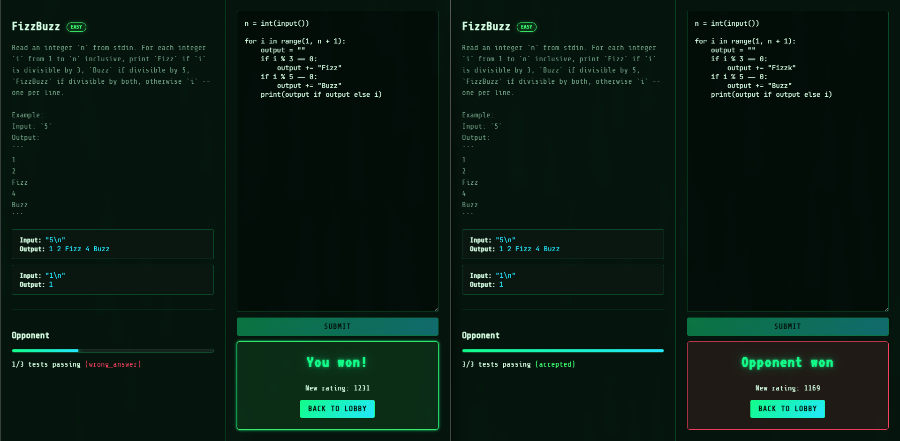 | 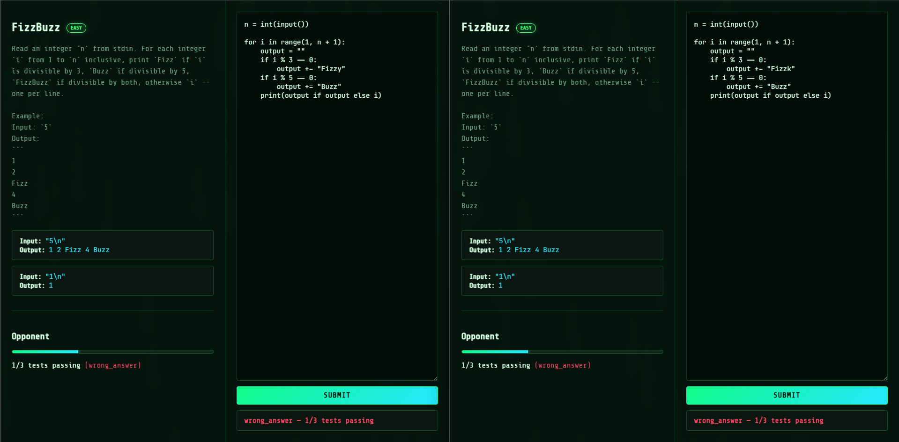 |
| Match complete — winner/loser banners + Elo rating swing | Live duel — opponent's test-pass progress streaming over WebSocket |
| 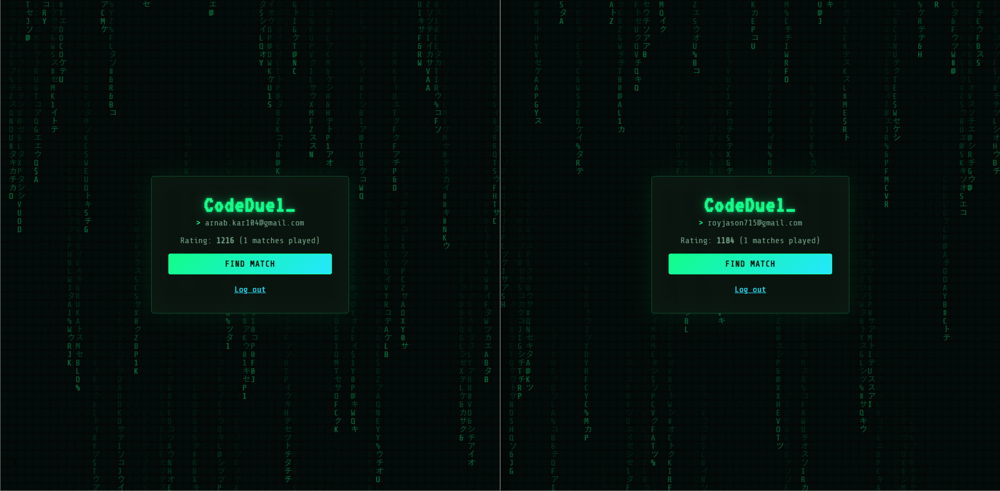 | 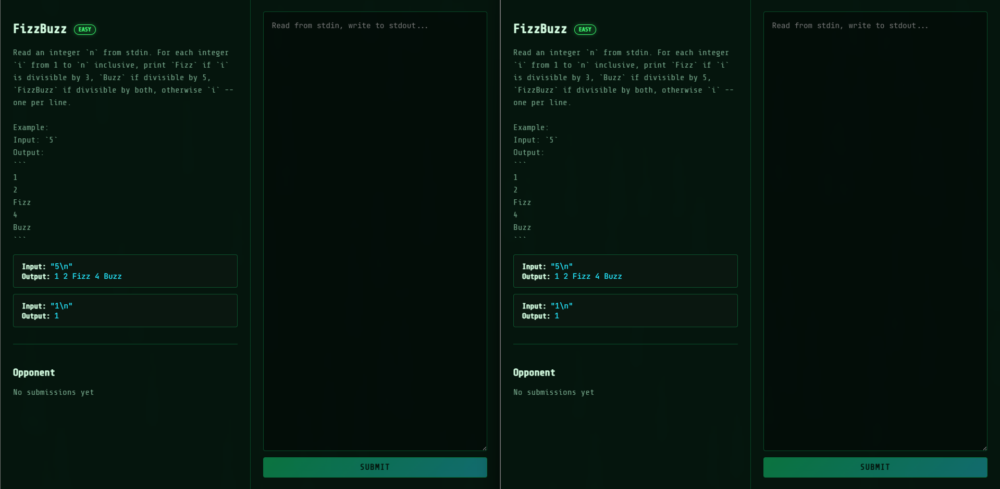 |
| Lobby — matchmaking queue | Just matched — same problem, empty scoreboard |
| 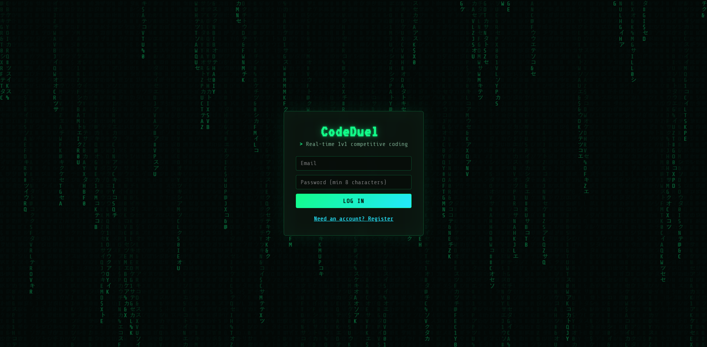 | 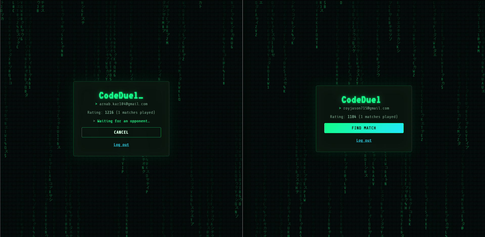 |
| Auth | Waiting for an opponent |

## Status

- [x] **Phase 1 — Problem model + sandboxed submission judging**
- [x] **Phase 2 — Matchmaking (Redis queue)**
- [x] **Phase 3 — WebSocket match rooms + live opponent progress**
- [x] **Phase 4 — Race-condition-safe win determination**
- [x] **Phase 5 — Elo rating**
- [x] **Phase 6 — Auth**
- [x] **Minimal React frontend** (register → matchmaking → live duel → winner banner)

## Architecture (target end-state)

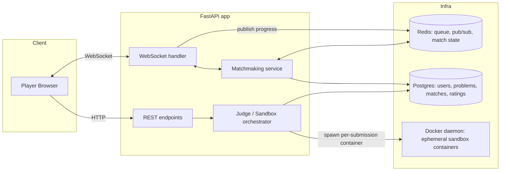

### Phase 1 slice (what exists today)

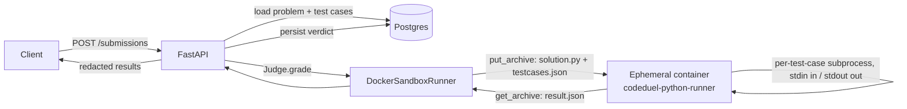

## Local development

Prereqs: Docker Desktop running, Python 3.14+.

```bash
cd backend

# 1. Infra
docker compose up -d              # Postgres + Redis

# 2. Sandbox image (what actually executes submitted code)
docker build -t codeduel-python-runner:latest app/execution/images/python

# 3. Python env
python -m venv .venv
./.venv/Scripts/pip install -r requirements.txt   # (or .venv/bin/pip on Linux/Mac)
cp .env.example .env

# 4. Schema + sample data
./.venv/Scripts/python -m alembic upgrade head
./.venv/Scripts/python -m scripts.seed

# 5. Run
./.venv/Scripts/python -m uvicorn app.main:app --reload --port 8000
# -> http://localhost:8000/docs

# 6. Tests (spins real containers and hits real Redis — nothing here is
#    mocked). Stop any locally-running `uvicorn` first: its background
#    matchmaker task polls the same Redis queue the tests use and will
#    race them for test players, causing spurious timeouts.
./.venv/Scripts/python -m pytest tests/ -v
```

Try it:
```bash
# Register (auto-logs-in: returns a bearer token straight away)
curl -X POST http://localhost:8000/auth/register -H "Content-Type: application/json" -d '{
  "email": "alice@example.com", "password": "correct-horse-1"
}'
# -> {"user_id": "...", "email": "alice@example.com", "token": "..."}
TOKEN="<token from above>"

# Submit a solution -- player_id is derived from the token, never sent by the client
curl -X POST http://localhost:8000/submissions \
  -H "Content-Type: application/json" -H "Authorization: Bearer $TOKEN" -d '{
  "problem_id": "<id from GET /problems>",
  "code": "a, b = map(int, input().split())\nprint(a + b)",
  "language": "python"
}'

# Matchmaking: register a second user, join the queue as both, watch them pair up
curl -X POST http://localhost:8000/queue/join -H "Authorization: Bearer $TOKEN" -d '{"display_name": "alice"}'
curl http://localhost:8000/queue/status -H "Authorization: Bearer $TOKEN"   # -> {"status": "matched", "match_id": "..."}

# Live progress: connect to the match room over WebSocket, authenticated via
# ?token= (not a header -- browsers can't set custom headers on a WS
# handshake, see the Design Decisions section). Requires `pip install websockets`.
python -c "
import asyncio, websockets
async def main():
    async with websockets.connect('ws://localhost:8000/ws/matches/<match_id>?token=$TOKEN') as ws:
        while True:
            print(await ws.recv())
asyncio.run(main())
"

# After a match completes, check either player's rating and the match record
curl http://localhost:8000/players/<player_id>/rating   # -> {"rating": 1216, "matches_played": 1, ...}
curl http://localhost:8000/matches/<match_id>            # -> includes winner_id + rating before/after
```

### Phase 2 slice: matchmaking

```mermaid
sequenceDiagram
    participant A as Player A
    participant B as Player B
    participant API as FastAPI
    participant R as Redis
    participant MM as matchmaker_loop (bg task)
    participant PG as Postgres

    A->>API: POST /queue/join
    API->>R: SADD queued, RPUSH queue
    MM->>R: BLPOP queue (blocks)
    B->>API: POST /queue/join
    API->>R: SADD queued, RPUSH queue
    R-->>MM: player A (FIFO)
    MM->>R: SADD pending(A)
    MM->>R: BLPOP queue
    R-->>MM: player B
    MM->>R: SADD pending(B)
    MM->>PG: INSERT Match(A, B, random problem)
    MM->>R: SREM queued(A,B); SET match_for_player(A/B); SREM pending(A,B)
    A->>API: GET /queue/status/A
    API-->>A: {status: matched, match_id}
    B->>API: GET /queue/status/B
    API-->>B: {status: matched, match_id}
```

### Phase 3 slice: live opponent progress

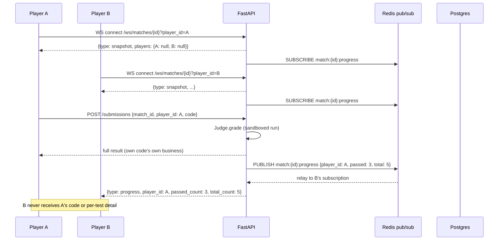

### Phase 4 slice: race-condition-safe win determination

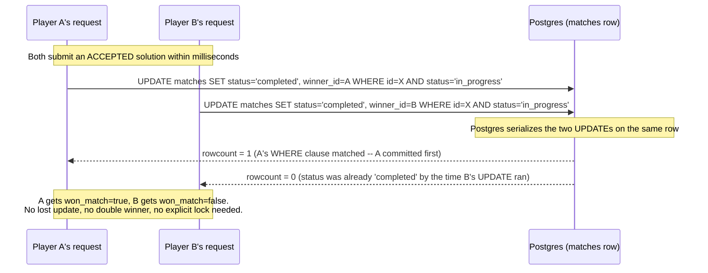

### Phase 5 slice: Elo rating

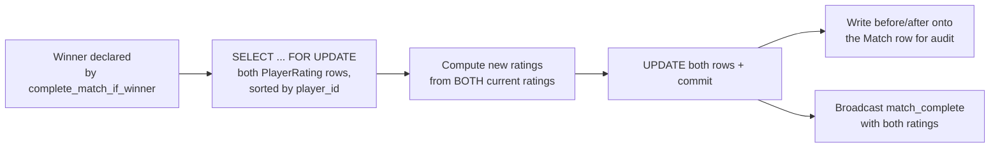

### Phase 6 slice: auth closes the player_id spoofing gap

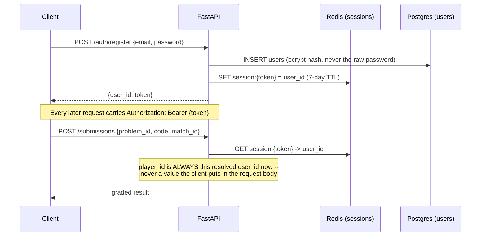

## Frontend

A minimal React app (Vite, plain JS, no UI library) covering the whole
loop: register/login, join the queue, watch a live duel, see the winner
and rating change. It exists to make the backend's real-time behavior
*visible* — screenshots/demos of two browser tabs racing are a much
stronger portfolio artifact than a curl transcript — not to be a frontend
showcase; there's no router, no state management library, no component
library.

### Running it

```bash
cd frontend
npm install
cp .env.example .env      # points at the local backend by default
npm run dev               # -> http://localhost:5173
```

The backend must already be running (`docker compose up -d` + `uvicorn`,
see above) — the frontend is a pure client of the same API used throughout
this README's `curl` examples.

### Frontend design decisions

**No router, no state library.** The whole app is one linear flow --
auth screen, then lobby, then match view -- so a single `view` decided by
`App.jsx`'s state (do we have a session? a matchId?) is simpler than
pulling in `react-router` for three screens that are never deep-linked to
directly. Same reasoning for state: plain `useState`/`useEffect` is
enough for a tree this shallow; Redux/Zustand would be solving a problem
this app doesn't have.

**Lobby polls `/queue/status`; the match view opens a WebSocket.**
Different tools for different lifetimes: waiting in a queue is short and
tolerant of a ~1s delay in noticing a match, so polling is simpler than
justifying a second WebSocket connection for it. Once inside a match, the
whole point is low-latency opponent updates for the match's entire
duration -- that's exactly what the phase 3 WebSocket exists for, and the
frontend just consumes it directly rather than re-deriving the same
signal by polling.

**Session in `localStorage`, token in a query param for the one place a
header won't work.** The bearer token lives in `localStorage` and rides
on every REST call as an `Authorization` header; the one exception is the
match WebSocket, which authenticates via `?token=` in the URL because a
browser's native `WebSocket` API cannot set custom headers on the
handshake at all -- the same constraint documented on the backend side.

**Verified in an actual headless browser, not just "should work."**
Two independent browser contexts (so two separate `localStorage`s, i.e.
two real logged-in users) drove the full flow end-to-end with Playwright:
register both, queue both, land in the same match, submit a winning
solution as one, and confirm the *other* browser context's UI updates
live from the WebSocket push -- with a check for zero console/network
errors along the way. That's what caught a real layout bug (native
`<button>` is `inline-block` by default, so two sibling buttons in the
lobby card sat side by side instead of stacking) that would have been
easy to miss reading the JSX alone.

## Design decisions

### Sandboxing: Docker SDK, not nsjail or firejail (for now)
Docker gives correct isolation (namespaces, cgroups, seccomp) via well-known
flags without hand-building a jail rootfs, at the cost of ~100-300ms
container-startup latency per submission. **nsjail** would give faster
cold starts and finer-grained seccomp-bpf syscall filtering — genuinely the
better choice for a production judge — but costs more setup (you own the
jail rootfs). **firejail** is built for sandboxing trusted desktop apps, not
untrusted code, and was ruled out. `execution/sandbox.py` defines a
`SandboxRunner` ABC specifically so swapping in nsjail later is one new
class, not a rewrite of the judge.

### Judging model: stdin/stdout, not "call a function the user defines"
A test case is `(input, expected_output)`; the submitted program is run as a
whole subprocess with `input` piped to stdin and its stdout diffed against
`expected_output`. The alternative — importing user code and calling a
function they define — would need per-language signature conventions and
means the judge has to import/execute-as-a-library code it doesn't trust.
Running it as an opaque subprocess is both simpler and matches how every
real competitive-programming judge (Codeforces, etc.) works.

### One throwaway container per submission
Every submission gets a brand-new container, always removed afterward
(`finally: container.remove(force=True)`, verified by an autouse pytest
fixture that fails the whole suite if any test leaks one). No container is
ever reused — reuse would risk one player's filesystem/process state
leaking into another's run.

### Two Docker API gotchas that shaped `docker_runner.py`
These were discovered by hitting them, not anticipated in advance:

1. **`put_archive` refuses to write into a container with `read_only=True`
   rootfs** — even onto a writable tmpfs mount. This is a hard restriction
   in the Docker API itself. Fix: don't set `read_only`; instead rely on
   the image's actual Unix permissions (`sandboxuser` is non-root and,
   verified directly, cannot write to anything outside `/sandbox`, `/tmp`,
   `/var/tmp`).
2. **tmpfs is memory-backed and dies with the container.** `/sandbox` was
   originally tmpfs-mounted; `put_archive()` (called before `start()`)
   wrote the submission's files to the container's *persistent* layer, then
   `start()` mounted an empty tmpfs *over* that path, hiding them from the
   harness — and anything the harness then wrote there (`result.json`)
   vanished the instant the container exited, before `get_archive()` could
   read it back. Fix: `/sandbox` is a real directory baked into the image
   and `chown`'d to `sandboxuser` (see the Dockerfile) — persistent for the
   container's lifetime. Only `/tmp`/`/var/tmp` (write-only scratch, never
   read back) stay tmpfs.

### Two-layer timeout
The in-container harness enforces a per-test-case timeout via
`subprocess` with `start_new_session=True`, killing the whole process group
on expiry (a plain `proc.kill()` only kills the immediate process, not a
fork bomb's children). `docker_runner.py` additionally bounds the whole
container's wall-clock life and force-kills it on top of that — the outer
layer exists because `docker kill` on a cgroup is the only mechanism
guaranteed to work no matter what goes wrong on the inside (a harness bug,
an interpreter hang before its own timeout logic even runs).

### Concurrency: bounded by a semaphore, run off the event loop
`docker-py` is a blocking/synchronous client, so sandbox runs go through
`asyncio.to_thread` — otherwise one submission would stall every other
in-flight request. A process-wide `asyncio.Semaphore(SANDBOX_MAX_CONCURRENT)`
caps how many real containers can be running at once, since each one is
real host CPU/memory that a burst of submissions could otherwise exhaust
without bound.

### Hidden test cases + where redaction happens
`TestCase.is_hidden` exists so a solution has to generalize instead of
special-casing the visible examples. The database always stores full detail
(a grading dispute needs the full picture); redaction to `null` happens in
exactly one place, `judge.to_public_results()`, right at the API boundary.

### UUID primary keys
`Problem`/`Submission` ids are exposed in URLs. Server-generated UUIDs avoid
leaking sequential counts and enumeration of other players' submissions —
worth the (irrelevant at this scale) cost over autoincrement ints.

### Matchmaking: a plain Redis list + BLPOP, no job-queue framework
`BLPOP` is atomic per call, so even with concurrent pairing attempts no two
callers can ever pop the same waiting player — uniqueness is guaranteed by
Redis itself, not by application-level locking. One `asyncio` background
task (started in FastAPI's `lifespan`) does the pairing, in-process — this
is the right amount of infrastructure for a single-instance free-tier
deployment; a distributed job queue would be solving a scaling problem this
project doesn't have.

### Two-phase pop-then-pair, for crash safety
Popping a player off the queue (`BLPOP`) and successfully pairing them into
a `Match` aren't the same instant — there's a window (a slow DB write,
blocking on a second `BLPOP` that might wait a while) where the process
could die with a player already popped but not yet matched, silently
losing them. `matchmaker.py` closes this by recording every popped player
in a `PENDING_SET_KEY` immediately after the pop, before anything that
could fail; a startup routine (`reconcile_pending_on_startup`) finds
anyone still marked pending — meaning a previous instance crashed mid-pair
— and puts them back in the queue. This is the same "intent log +
reconciliation on restart" pattern used in real distributed systems to
survive a crash between two non-atomic steps, scaled down to one Redis set.

### Idempotent join, and a stale-state bug it surfaced
`POST /queue/join` accepts an optional `player_id` the client already
holds, so retrying a join (e.g. after a flaky network) is safe — `SADD`'s
return value (1 if newly added, 0 if already a member) is an atomic
check-and-set, so two concurrent join calls for the same id can never both
enqueue. Building this surfaced a real bug, caught by manually walking the
join → match → leave → rejoin path rather than by the automated tests
(which then got a regression test added): a player's old `match_id` was
never cleared on a fresh join, so `get_status()` — which checks "are you
matched" before "are you queued" — kept reporting a stale match from a
previous game. Fixed by clearing the old match assignment as part of
`enqueue()`. Worth remembering: an automated suite only catches what it
was written to check; walking the actual flow by hand still finds things
tests didn't think to ask.

### Progress granularity: per-submission, not per-test-case
Our sandbox runs finish in tens of milliseconds (see phase 1) — streaming
updates *within* a single run wouldn't be visible, let alone useful. The
signal that actually matters in a duel is *across* submissions: "opponent
just submitted, now at 3/5 passing." So a live progress push happens once
per graded submission, not once per test case inside it. Building
intra-run streaming (the harness writing incremental progress mid-run,
the host polling for it) would have been solving a UX problem this
project's execution speed doesn't create.

### Redis pub/sub as the fan-out, not an in-process connection registry
The obvious naive approach is a process-wide `dict[match_id, list[WebSocket]]`.
That works right up until there's more than one app instance behind a load
balancer, at which point player A's submission and player B's WebSocket
connection can silently end up on different instances that never talk to
each other — a bug that's invisible in local dev (there's only ever one
instance) and only shows up in production. Every WS connection instead
subscribes to a Redis channel (`match:{id}:progress`); the judge publishes
to that channel rather than reaching into any local connection state. Same
number of moving parts today, correct at a scale this project isn't even
running at yet.

### Redaction lives in one place: the publisher, not the relay
`realtime/broadcaster.py`'s `publish_progress()` is the only function that
constructs the message that goes out over Redis — it takes `passed_count`/
`total_count`/`status` as explicit arguments, not a `Submission` object it
could be tempted to serialize wholesale. The WebSocket handler that relays
it (`routes_ws.py`) never sees the submission, the code, or the results
JSON at all — there's nothing for it to accidentally leak, by construction,
rather than by remembering to redact at the point where it's used.

### A known gap: no automated test drives the WebSocket end-to-end
`engine` and `redis_client` are process-wide async singletons — the right
design for the real app (exactly one event loop for its whole life).
Starlette's `TestClient`, however, drives the ASGI app from a *separate*
thread with its *own* event loop, so any test mixing `TestClient` with
those singletons hits the same cross-loop connection error phase 1 already
surfaced once (see the pytest-asyncio note in `pytest.ini`) — just from a
different direction, and not fixable by a pytest-config tweak this time
without adding real dependency-injection plumbing to swap those singletons
per-test. Rather than force that in, this phase was verified with a live
smoke test instead — two real WebSocket connections, over real sockets,
against the actual running dev server, driving the full matchmaking →
connect → submit → push flow end-to-end. Arguably the more convincing proof
for a feature whose entire point is "real concurrent socket connections,"
but it's a manual step, not something CI runs — worth fixing properly
(via a request/test-scoped resource factory) before this ever needs to gate
a deploy.

### Atomic UPDATE-with-guard, not SELECT FOR UPDATE
Two ways to make "declare a winner" race-safe: (a) `SELECT ... FOR UPDATE`
to lock the row, check its status in application code, then `UPDATE` if
still in progress; or (b) a single `UPDATE ... WHERE status = 'in_progress'`
that folds the check into the write itself. This project uses (b) — one
round trip instead of two, and there's no window between "check" and "act"
for application code to get it wrong, because there is no separate check
step. `SELECT FOR UPDATE` is the more general tool (needed when the
decision requires reading several things before deciding what to write);
here, the entire decision *is* "is status still in_progress", which the
UPDATE's own WHERE clause already expresses.

### Proven with a genuine concurrency test, not a sequential one
`tests/test_match_completion.py` doesn't just call
`complete_match_if_winner` twice in a row — that would pass even with a
naive, non-atomic implementation, since sequential calls never actually
contend for anything. Both attempts are started as separate asyncio tasks
gated behind a shared `asyncio.Event`, released together, so their UPDATEs
reach Postgres as close to simultaneously as the process can arrange, each
over its own real connection and transaction. The test asserts the
invariant (`result_a != result_b` — never both, never neither) rather than
which one wins, since which one wins is genuinely nondeterministic and
running it repeatedly confirms both outcomes actually occur. A separate
end-to-end test races two calls to the real `create_submission` handler
itself (not just the completion primitive), and a live smoke test against
the real running server confirmed the same thing over actual HTTP requests
and a real WebSocket push — the winner varying run-to-run there too.

### The pre-check that isn't the guarantee
`routes_submissions.py` rejects a submission with 409 if the match's
status isn't `in_progress` — but this check happens via a plain read
*before* grading, so it has its own (harmless) race: the match could
complete in the gap between this check and the grading finishing. That's
fine, and deliberate: this check exists purely to avoid burning a sandbox
run on a match that's obviously already over, not to prevent double
winners. The actual correctness guarantee is entirely inside
`complete_match_if_winner`'s atomic UPDATE, which doesn't care what any
earlier read observed.

### Elo update: a different concurrency shape needs a different tool
Win determination (phase 4) could be a single atomic UPDATE because the
entire decision was "is status still in_progress" -- expressible in a
WHERE clause with no read step. Elo update genuinely can't be: computing
either player's new rating requires knowing BOTH players' current ratings
first. That's a read-compute-write cycle, so `matches/rating.py` uses
`SELECT ... FOR UPDATE` on both `PlayerRating` rows instead -- the right
tool for a different shape of problem, not a weaker version of phase 4's.

### Consistent lock ordering, proven by breaking it on purpose
Both rating rows are locked in a fixed order -- sorted by `player_id`,
never "winner first, then loser" -- so two concurrent updates touching the
same *pair* of players (say, a rematch resolving while an earlier result
for the same two is still being processed) can never acquire the two locks
in opposite orders, which is what causes deadlock. This wasn't just
asserted: I temporarily reverted the sort to "winner-then-loser" and reran
`test_concurrent_updates_on_an_overlapping_pair_never_deadlock` — it
failed immediately with Postgres's actual `DeadlockDetectedError`, not a
hang. That run surfaced a *second*, unrelated real bug in the same
function: `SELECT ... FOR UPDATE` only locks a row that already exists, so
two concurrent first-ever-match calls for the same brand-new `player_id`
could both see "no row" and both try to `INSERT`, racing into a
unique-constraint violation. Fixed with `INSERT ... ON CONFLICT DO
NOTHING` before the lock-and-select. Both fixes are in
`matches/rating.py`'s module docstring with the full reasoning — this is
the clearest example in the project of a test that found a bug it wasn't
specifically written to find.

### One row per player, not a ratings-history table
`PlayerRating` holds only each player's *current* rating — no append-only
history of every change. The lightweight audit trail that would otherwise
require a history table instead lives directly on `Match`
(`winner_rating_before/after`, `loser_rating_before/after`), populated
once at completion. That covers "show the rating swing for this specific
match" without the join/query overhead of a full history table — the
right scope for "simple Elo," with a real history table as the obvious
next step if a rating-over-time graph ever becomes a feature.

### Ratings were keyed by a guest player_id, until phase 6 closed that
Before auth landed, a rating was only as durable as whatever `player_id` a
client happened to reuse across sessions — a forward-compatible
placeholder, explicitly noted at the time as something phase 6 would
replace. It now has: `player_id` is the authenticated user's real,
permanent id, and none of the rating logic (this file, `matches/rating.py`)
needed to change at all to pick that up -- it was always "just a UUID" to
that code, which is exactly the point of having deferred the decision.

### Auth closes a real spoofing gap, not a theoretical one
Before phase 6, `POST /submissions` and `POST /queue/join` both accepted
`player_id` as a client-supplied value with zero verification. Anyone
could submit code (or claim a match win, or cancel someone's queue entry)
as any `player_id` they liked, simply by putting a different UUID in the
request. This wasn't a hardening pass after the fact -- every request that
used to read `player_id` from the request body now reads it from
`Depends(get_current_user_id)` instead, and the field was deleted from
those request schemas entirely (not just ignored) so there's no path left
that accepts a caller-supplied identity for anything security-relevant.

### bcrypt directly, not passlib
`passlib` is the usual recommendation for password hashing in Python, but
its bcrypt backend has a real compatibility rough edge with recent bcrypt
releases (it reads a version attribute newer bcrypt removed). Since this
project only ever needs one hashing scheme, calling bcrypt's own small,
stable API directly (`auth/security.py`) sidesteps that friction rather
than pinning around it -- one less abstraction layer for a need that never
called for the abstraction.

### Session tokens in Redis, not JWTs
A session is an opaque random token mapped to a user id in Redis with a
TTL -- already-wired infrastructure (Redis is used for matchmaking and
pub/sub elsewhere), so this is zero new infra. The concrete advantage over
a stateless JWT: logout actually revokes the session immediately (delete
the key), rather than needing a separate blocklist bolted onto a scheme
that's stateless specifically so it *wouldn't* need one.

### WebSocket auth has to be different, and that's a browser limitation
Every other authenticated endpoint takes a bearer token in an
`Authorization` header. The match WebSocket takes `?token=` in the query
string instead -- not a style inconsistency, but a hard constraint: a
browser's native WebSocket API has no way to set custom headers on the
handshake request at all. Query-string auth is the accepted, if imperfect,
answer to that in real production systems too; the known cost is visible
right in this project's own access logs (the token appears in the request
line for `/ws/matches/...?token=...`), which is worth being able to name
as a tradeoff rather than something to gloss over.

### What auth deliberately doesn't cover
No rate limiting on login attempts, no password reset flow, no email
verification, no "remember me" vs. short-lived session distinction --
"simple email/password, don't over-build it" was the explicit brief for
this phase, and all four are real gaps a production system would need,
not oversights. Existing player_id columns on `Match`/`Submission`/
`PlayerRating` also still have no FK to `users` (see db/models.py) --
retrofitting that would mean deleting pre-auth test data or adding
unvalidated constraints, deferred as out of scope for an auth-focused
phase rather than done halfway.

## Good LinkedIn-post material from this phase
- "I sandboxed untrusted code execution with Docker, then wrote an
  adversarial test suite to try to break it" — walk through the fork bomb /
  memory bomb / network-escape / filesystem-escape tests in
  `tests/test_sandbox_adversarial.py` and what each one proves.
- The two Docker API gotchas above (`put_archive` + `read_only`, and tmpfs
  ephemerality) — a good "here's a subtle distributed-systems bug I hit and
  how I diagnosed it" story, since both were found by direct debugging
  (inspecting exit codes, `docker cp`-ing a container's raw filesystem)
  rather than known in advance.
- Why stdin/stdout judging beats "import and call a function" for a
  multi-language competitive judge.
- The matchmaking queue's two-phase pop-then-pair + crash reconciliation —
  a compact, explainable example of "how do you make an at-least-once
  guarantee out of a data store with no transactions across two commands."
- The stale-match bug: a good story about the limits of automated tests and
  the value of manually exercising a feature end-to-end before calling it
  done.
- "Why I chose Redis pub/sub over an in-memory connection registry for
  WebSocket fan-out" — a small decision that's invisible until you scale
  past one instance, which is exactly the kind of thing that's worth being
  able to explain even in a single-instance portfolio deployment.
- The redaction-by-construction design in `broadcaster.py` (the function
  signature itself makes leaking code impossible, rather than relying on
  remembering to strip it) — a nice example of designing an API so the
  unsafe thing is simply not expressible.
- The honest gap: process-wide async singletons vs. `TestClient`'s
  threaded execution model, and why this phase shipped with a live smoke
  test instead of an automated one — a good "here's a real engineering
  tradeoff I made and can defend" story rather than a claim that
  everything has 100% automated coverage.
- This is probably the single best interview story in the whole project:
  "two players submit a winning solution within milliseconds of each
  other — how do you guarantee exactly one of them wins, with no lost
  update, using nothing but a single UPDATE statement?" Walk through
  `matches/completion.py`'s docstring, why an atomic UPDATE-with-guard
  beats SELECT FOR UPDATE here, and how `test_match_completion.py` proves
  it with two genuinely concurrent asyncio tasks racing real Postgres
  transactions rather than a test that would pass even if the
  implementation were broken.
- Maybe the best "how I actually work" story in the whole project: I broke
  my own deadlock fix on purpose to prove the test would catch it, and in
  doing so found a *second*, real, previously-undetected bug (SELECT FOR
  UPDATE not protecting row creation) that the test wasn't even written to
  look for. That's a much stronger story than "I wrote a test and it
  passed" — it's "I verified my test could fail, and it immediately
  earned its keep."
- Why win determination (a single atomic UPDATE) and Elo update (SELECT
  FOR UPDATE + consistent lock ordering) needed two genuinely different
  concurrency-control techniques in the same feature, and how to tell
  which one a given problem calls for — a good demonstration of not
  reaching for one tool everywhere.
- "Adding auth didn't just add login/logout — it deleted a real spoofing
  vulnerability that existed in every earlier phase." Concrete, specific,
  and shows the kind of security thinking that goes beyond "I added a
  login page": naming the exact requests that used to trust a
  client-supplied identity, and showing they've been changed to delete
  that field entirely rather than merely stop reading it.
- Why the WebSocket endpoint's auth had to work completely differently
  from every REST endpoint's — a genuinely interesting constraint (browser
  WebSocket API can't set custom headers) most people haven't run into,
  with visible proof in this project's own access logs.
- bcrypt-directly-vs-passlib and Redis-sessions-vs-JWT are both "I
  evaluated the standard-recommended tool and chose something narrower on
  purpose" stories — good material for "how do you decide when to reach
  for a library vs. roll the 10 lines yourself."
- The frontend verification itself is a good post: two independent
  headless-browser sessions (two real logged-in users, two real
  WebSocket connections) driving the entire duel end-to-end, screenshot
  by screenshot, and catching a real layout bug in the process — a
  concrete example of "verify it actually works" applied to UI, not just
  backend logic.
