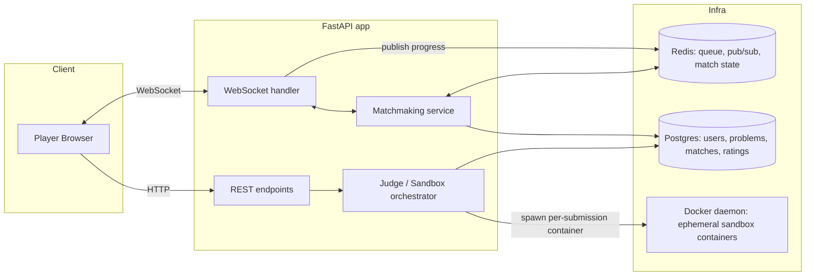
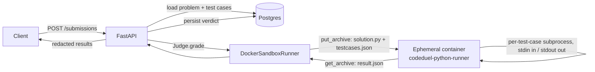

# CodeDuel

A real-time 1v1 competitive coding duel platform — "chess.com for coding".
Two players get the same problem and race to submit a correct solution
first, with live visibility into each other's progress (but never each
other's code).

This is a portfolio project built to demonstrate backend/distributed-systems
depth: sandboxed untrusted-code execution, real-time sync over WebSockets,
and race-condition-safe match resolution — not feature count.

## Status

- [x] **Phase 1 — Problem model + sandboxed submission judging**
- [x] **Phase 2 — Matchmaking (Redis queue)**
- [ ] Phase 3 — WebSocket match rooms + live opponent progress
- [ ] Phase 4 — Race-condition-safe win determination
- [ ] Phase 5 — Elo rating
- [ ] Phase 6 — Auth

## Architecture (target end-state)



### Phase 1 slice (what exists today)



## Local development

Prereqs: Docker Desktop running, Python 3.14+.

```bash
cd backend

# 1. Infra
docker compose up -d              # Postgres + Redis

# 2. Sandbox image (what actually executes submitted code)
docker build -t codeduel-python-runner:latest app/execution/images/python

# 3. Python env
python -m venv .venv
./.venv/Scripts/pip install -r requirements.txt   # (or .venv/bin/pip on Linux/Mac)
cp .env.example .env

# 4. Schema + sample data
./.venv/Scripts/python -m alembic upgrade head
./.venv/Scripts/python -m scripts.seed

# 5. Run
./.venv/Scripts/python -m uvicorn app.main:app --reload --port 8000
# -> http://localhost:8000/docs

# 6. Tests (spins real containers and hits real Redis — nothing here is
#    mocked). Stop any locally-running `uvicorn` first: its background
#    matchmaker task polls the same Redis queue the tests use and will
#    race them for test players, causing spurious timeouts.
./.venv/Scripts/python -m pytest tests/ -v
```

Try it:
```bash
# Submit a solution
curl -X POST http://localhost:8000/submissions -H "Content-Type: application/json" -d '{
  "problem_id": "<id from GET /problems>",
  "code": "a, b = map(int, input().split())\nprint(a + b)",
  "language": "python"
}'

# Matchmaking: join the queue twice (two "players") and watch them pair up
curl -X POST http://localhost:8000/queue/join -H "Content-Type: application/json" -d '{"display_name": "alice"}'
curl -X POST http://localhost:8000/queue/join -H "Content-Type: application/json" -d '{"display_name": "bob"}'
curl http://localhost:8000/queue/status/<alice's player_id>   # -> {"status": "matched", "match_id": "..."}
```

### Phase 2 slice: matchmaking

```mermaid
sequenceDiagram
    participant A as Player A
    participant B as Player B
    participant API as FastAPI
    participant R as Redis
    participant MM as matchmaker_loop (bg task)
    participant PG as Postgres

    A->>API: POST /queue/join
    API->>R: SADD queued, RPUSH queue
    MM->>R: BLPOP queue (blocks)
    B->>API: POST /queue/join
    API->>R: SADD queued, RPUSH queue
    R-->>MM: player A (FIFO)
    MM->>R: SADD pending(A)
    MM->>R: BLPOP queue
    R-->>MM: player B
    MM->>R: SADD pending(B)
    MM->>PG: INSERT Match(A, B, random problem)
    MM->>R: SREM queued(A,B); SET match_for_player(A/B); SREM pending(A,B)
    A->>API: GET /queue/status/A
    API-->>A: {status: matched, match_id}
    B->>API: GET /queue/status/B
    API-->>B: {status: matched, match_id}
```

## Design decisions

### Sandboxing: Docker SDK, not nsjail or firejail (for now)
Docker gives correct isolation (namespaces, cgroups, seccomp) via well-known
flags without hand-building a jail rootfs, at the cost of ~100-300ms
container-startup latency per submission. **nsjail** would give faster
cold starts and finer-grained seccomp-bpf syscall filtering — genuinely the
better choice for a production judge — but costs more setup (you own the
jail rootfs). **firejail** is built for sandboxing trusted desktop apps, not
untrusted code, and was ruled out. `execution/sandbox.py` defines a
`SandboxRunner` ABC specifically so swapping in nsjail later is one new
class, not a rewrite of the judge.

### Judging model: stdin/stdout, not "call a function the user defines"
A test case is `(input, expected_output)`; the submitted program is run as a
whole subprocess with `input` piped to stdin and its stdout diffed against
`expected_output`. The alternative — importing user code and calling a
function they define — would need per-language signature conventions and
means the judge has to import/execute-as-a-library code it doesn't trust.
Running it as an opaque subprocess is both simpler and matches how every
real competitive-programming judge (Codeforces, etc.) works.

### One throwaway container per submission
Every submission gets a brand-new container, always removed afterward
(`finally: container.remove(force=True)`, verified by an autouse pytest
fixture that fails the whole suite if any test leaks one). No container is
ever reused — reuse would risk one player's filesystem/process state
leaking into another's run.

### Two Docker API gotchas that shaped `docker_runner.py`
These were discovered by hitting them, not anticipated in advance:

1. **`put_archive` refuses to write into a container with `read_only=True`
   rootfs** — even onto a writable tmpfs mount. This is a hard restriction
   in the Docker API itself. Fix: don't set `read_only`; instead rely on
   the image's actual Unix permissions (`sandboxuser` is non-root and,
   verified directly, cannot write to anything outside `/sandbox`, `/tmp`,
   `/var/tmp`).
2. **tmpfs is memory-backed and dies with the container.** `/sandbox` was
   originally tmpfs-mounted; `put_archive()` (called before `start()`)
   wrote the submission's files to the container's *persistent* layer, then
   `start()` mounted an empty tmpfs *over* that path, hiding them from the
   harness — and anything the harness then wrote there (`result.json`)
   vanished the instant the container exited, before `get_archive()` could
   read it back. Fix: `/sandbox` is a real directory baked into the image
   and `chown`'d to `sandboxuser` (see the Dockerfile) — persistent for the
   container's lifetime. Only `/tmp`/`/var/tmp` (write-only scratch, never
   read back) stay tmpfs.

### Two-layer timeout
The in-container harness enforces a per-test-case timeout via
`subprocess` with `start_new_session=True`, killing the whole process group
on expiry (a plain `proc.kill()` only kills the immediate process, not a
fork bomb's children). `docker_runner.py` additionally bounds the whole
container's wall-clock life and force-kills it on top of that — the outer
layer exists because `docker kill` on a cgroup is the only mechanism
guaranteed to work no matter what goes wrong on the inside (a harness bug,
an interpreter hang before its own timeout logic even runs).

### Concurrency: bounded by a semaphore, run off the event loop
`docker-py` is a blocking/synchronous client, so sandbox runs go through
`asyncio.to_thread` — otherwise one submission would stall every other
in-flight request. A process-wide `asyncio.Semaphore(SANDBOX_MAX_CONCURRENT)`
caps how many real containers can be running at once, since each one is
real host CPU/memory that a burst of submissions could otherwise exhaust
without bound.

### Hidden test cases + where redaction happens
`TestCase.is_hidden` exists so a solution has to generalize instead of
special-casing the visible examples. The database always stores full detail
(a grading dispute needs the full picture); redaction to `null` happens in
exactly one place, `judge.to_public_results()`, right at the API boundary.

### UUID primary keys
`Problem`/`Submission` ids are exposed in URLs. Server-generated UUIDs avoid
leaking sequential counts and enumeration of other players' submissions —
worth the (irrelevant at this scale) cost over autoincrement ints.

### Matchmaking: a plain Redis list + BLPOP, no job-queue framework
`BLPOP` is atomic per call, so even with concurrent pairing attempts no two
callers can ever pop the same waiting player — uniqueness is guaranteed by
Redis itself, not by application-level locking. One `asyncio` background
task (started in FastAPI's `lifespan`) does the pairing, in-process — this
is the right amount of infrastructure for a single-instance free-tier
deployment; a distributed job queue would be solving a scaling problem this
project doesn't have.

### Two-phase pop-then-pair, for crash safety
Popping a player off the queue (`BLPOP`) and successfully pairing them into
a `Match` aren't the same instant — there's a window (a slow DB write,
blocking on a second `BLPOP` that might wait a while) where the process
could die with a player already popped but not yet matched, silently
losing them. `matchmaker.py` closes this by recording every popped player
in a `PENDING_SET_KEY` immediately after the pop, before anything that
could fail; a startup routine (`reconcile_pending_on_startup`) finds
anyone still marked pending — meaning a previous instance crashed mid-pair
— and puts them back in the queue. This is the same "intent log +
reconciliation on restart" pattern used in real distributed systems to
survive a crash between two non-atomic steps, scaled down to one Redis set.

### Idempotent join, and a stale-state bug it surfaced
`POST /queue/join` accepts an optional `player_id` the client already
holds, so retrying a join (e.g. after a flaky network) is safe — `SADD`'s
return value (1 if newly added, 0 if already a member) is an atomic
check-and-set, so two concurrent join calls for the same id can never both
enqueue. Building this surfaced a real bug, caught by manually walking the
join → match → leave → rejoin path rather than by the automated tests
(which then got a regression test added): a player's old `match_id` was
never cleared on a fresh join, so `get_status()` — which checks "are you
matched" before "are you queued" — kept reporting a stale match from a
previous game. Fixed by clearing the old match assignment as part of
`enqueue()`. Worth remembering: an automated suite only catches what it
was written to check; walking the actual flow by hand still finds things
tests didn't think to ask.

## Good LinkedIn-post material from this phase
- "I sandboxed untrusted code execution with Docker, then wrote an
  adversarial test suite to try to break it" — walk through the fork bomb /
  memory bomb / network-escape / filesystem-escape tests in
  `tests/test_sandbox_adversarial.py` and what each one proves.
- The two Docker API gotchas above (`put_archive` + `read_only`, and tmpfs
  ephemerality) — a good "here's a subtle distributed-systems bug I hit and
  how I diagnosed it" story, since both were found by direct debugging
  (inspecting exit codes, `docker cp`-ing a container's raw filesystem)
  rather than known in advance.
- Why stdin/stdout judging beats "import and call a function" for a
  multi-language competitive judge.
- The matchmaking queue's two-phase pop-then-pair + crash reconciliation —
  a compact, explainable example of "how do you make an at-least-once
  guarantee out of a data store with no transactions across two commands."
- The stale-match bug: a good story about the limits of automated tests and
  the value of manually exercising a feature end-to-end before calling it
  done.
